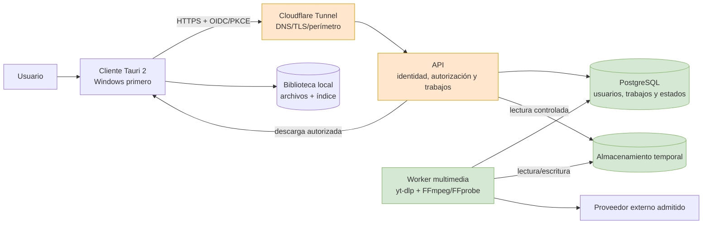
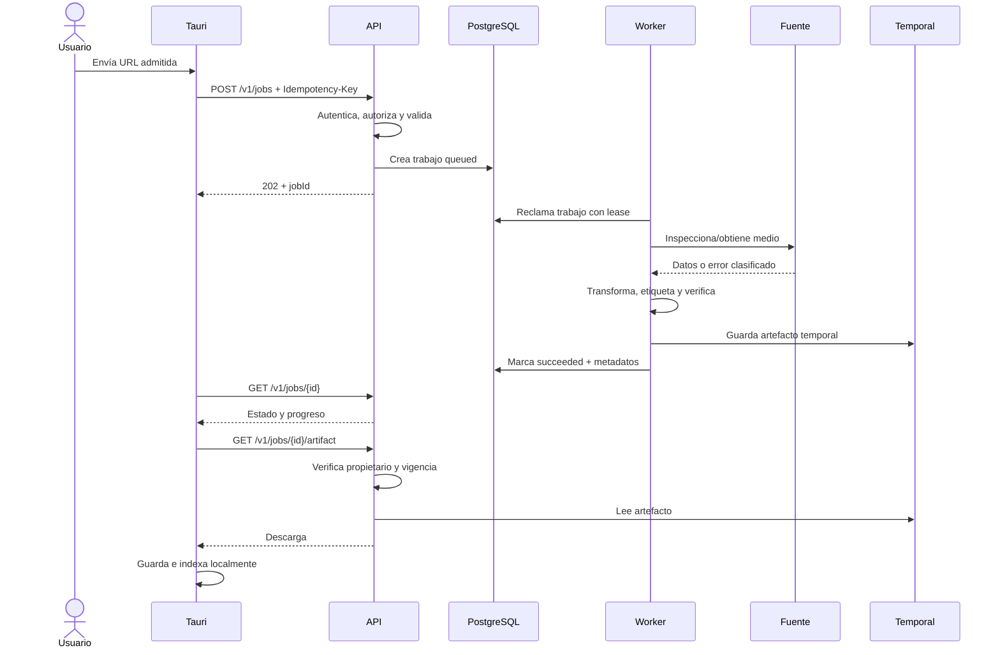
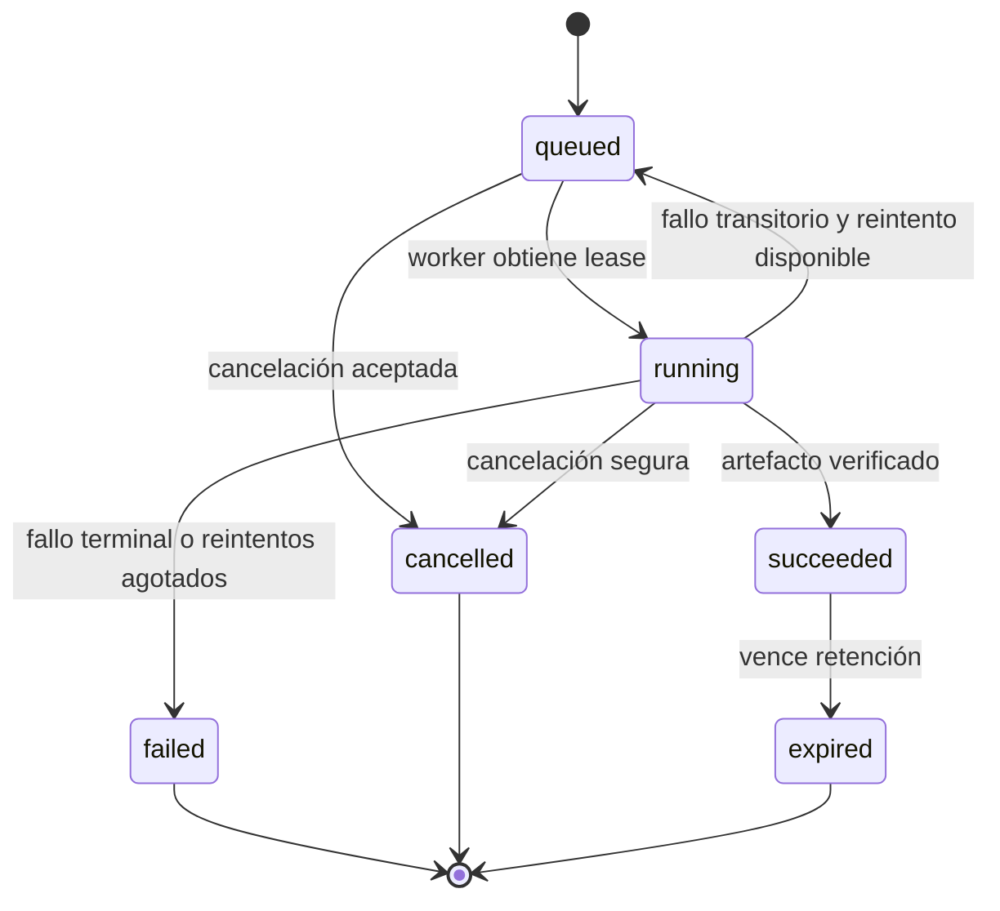

# Arquitectura inicial

**Estado:** Propuesta para el MVP  
**Versión:** 0.1  
**Fecha:** 2026-08-12

## 1. Enfoque recomendado

La solución será un sistema cliente-servidor con un **monolito modular en la API** y un **worker de procesamiento independiente**. Esta separación responde a límites reales de seguridad y recursos; no implica adoptar microservicios.

La aplicación instalada y la plataforma de servidor son productos distintos:

- Tauri no contiene credenciales privadas del servidor ni acceso directo a la base de datos.
- La API no administra permanentemente la biblioteca local del usuario.
- El worker no recibe tráfico público ni decide autorización de usuarios.

## 2. Vista de contexto y contenedores

Cloudflare reduce exposición de red y evita abrir puertos del router, pero no reemplaza autenticación, autorización, validación ni rate limiting de la aplicación.

## 3. Responsabilidades

### 3.1 Cliente Tauri

- Ejecutar el flujo de autenticación aprobado mediante navegador del sistema.
- Enviar solicitudes y mostrar estado/progreso/errores.
- Descargar únicamente mediante la API.
- Pedir permiso explícito para rutas locales.
- Mantener el índice de biblioteca local, propuesto en SQLite.
- Guardar tokens en el almacén seguro del sistema operativo.
- Limitar los comandos Tauri y capacidades del WebView al mínimo necesario.

No debe conectarse directamente a PostgreSQL, conocer secretos del servidor ni ejecutar `yt-dlp` remotamente por su cuenta en el MVP.

### 3.2 API

- Validar identidad, autorización, entrada y políticas de uso.
- Crear trabajos idempotentes y exponer su estado.
- Aplicar cuotas y rate limiting.
- Entregar resultados solo a su propietario y durante la retención.
- Emitir códigos de error estables y logs correlacionados.
- Proporcionar health checks y documentación OpenAPI.

No debe transcodificar en el proceso HTTP.

### 3.3 Worker

- Reclamar trabajos de una cola durable.
- Inspeccionar la fuente mediante el adaptador correspondiente.
- Ejecutar `yt-dlp`, FFmpeg y FFprobe con parámetros controlados.
- Normalizar metadatos, verificar resultados y actualizar el estado.
- Administrar artefactos temporales y cooperar con su limpieza.
- Clasificar fallos en transitorios y terminales.

No publica puertos al host ni autentica usuarios finales.

### 3.4 PostgreSQL

- Persistir identidades referenciadas, trabajos, intentos, estados e información de artefactos.
- Proporcionar transacciones y bloqueos para reclamar trabajos en el MVP, si se aprueba ADR-0004.
- Mantener restricciones e índices alineados con patrones de acceso.

No almacena archivos multimedia binarios.

### 3.5 Almacenamiento temporal

- MVP: volumen nombrado de Docker compartido entre worker y API, con escritura reservada al worker siempre que el runtime lo permita.
- Futuro: implementación compatible con S3 detrás de la misma interfaz de almacenamiento.
- Todo artefacto incluye propietario, tamaño, checksum, tipo, fecha de creación y expiración en la base de datos.

## 4. Despliegue inicial

Contenedores previstos:

| Servicio | Publicación | Persistencia | Función |
|---|---|---|---|
| `cloudflared` | Salida hacia Cloudflare | Token/configuración secreta | Conecta el dominio con la API. |
| `api` | Solo red de entrada del túnel | Sin estado local permanente | HTTP, autenticación y coordinación. |
| `worker` | Ningún puerto público | Acceso a volumen temporal | Procesamiento intensivo. |
| `postgres` | Solo red privada de backend | Volumen `postgres-data` | Datos transaccionales y cola propuesta. |

Redes lógicas recomendadas:

- `edge`: `cloudflared` y `api`.
- `backend`: `api`, `worker` y `postgres`.
- El almacenamiento temporal se monta solo en los servicios que lo necesiten.

La separación en contenedores mejora aislamiento, despliegue y escalado independiente del worker. No impide que API y worker compartan un repositorio o paquetes internos durante el MVP.

## 5. Flujo principal

Para el MVP, el cliente puede consultar estado con polling acotado. Server-Sent Events se evaluará solo si la experiencia lo exige; WebSockets no son necesarios de inicio.

## 6. Máquina de estados

Las transiciones deben efectuarse dentro de transacciones y con control de concurrencia. Un lease vencido permite recuperar trabajos abandonados sin ejecutar reintentos ilimitados.

## 7. Modelo de datos conceptual

| Entidad | Datos esenciales | Restricciones relevantes |
|---|---|---|
| `users` | ID interno, subject del IdP, estado, timestamps | `subject` único por emisor. |
| `jobs` | propietario, URL normalizada/cifrada según necesidad, estado, perfil, intentos, lease, progreso | Estado válido; índices por propietario/fecha y cola/estado. |
| `job_attempts` | job, worker, inicio/fin, resultado, código de error | Historial inmutable de intentos. |
| `artifacts` | job, clave de almacenamiento, tamaño, hash, MIME, expiración | Un artefacto principal activo por trabajo en MVP. |
| `job_metadata` | campos descriptivos y técnicos normalizados | Datos opcionales, longitudes limitadas. |

Los tokens de identidad, secretos del túnel y credenciales de herramientas no pertenecen a estas tablas.

## 8. Contrato HTTP inicial

Recursos tentativos, sujetos a diseño OpenAPI:

- `POST /v1/jobs` — crea una solicitud idempotente; responde `202 Accepted`.
- `GET /v1/jobs/{jobId}` — consulta trabajo del usuario.
- `POST /v1/jobs/{jobId}/cancellation` — solicita cancelación idempotente.
- `GET /v1/jobs/{jobId}/artifact` — entrega o redirige a descarga temporal autorizada.
- `GET /health/live` — proceso activo.
- `GET /health/ready` — dependencias mínimas disponibles.

El formato de error seguirá un esquema único, preferiblemente RFC 9457 Problem Details, con `type`, `title`, `status`, `code`, `detail` seguro, `instance` y `correlationId`.

## 9. Tecnologías: decisión aprobada y alternativas

El 2026-08-12 se aprobó Python + FastAPI para API/worker y React + TypeScript para la UI Tauri. PostgreSQL, SQLAlchemy 2 y Alembic forman la persistencia remota; SQLite será el índice local. Las alternativas evaluadas fueron:

| Opción | Ventajas | Costos | Adecuación |
|---|---|---|---|
| TypeScript + NestJS | Mercado amplio, contratos claros, estructura consistente, comparte tipos/conocimiento con UI. | Mayor consumo que Go; disciplina para no acoplar decoradores al dominio. | Alternativa válida, no elegida para el MVP. |
| Python + FastAPI | Integración natural con automatización multimedia, rápido para iterar, tipado gradual. | Más cuidado con trabajos CPU, packaging y consistencia de tipos. | **Seleccionada** por continuidad con el beta y ajuste al worker. |
| C# + ASP.NET Core | Rendimiento, tipado fuerte, tooling y ecosistema Windows sólidos. | Curva y repositorio potencialmente políglota. | Muy buena opción si se quiere profundizar en .NET. |
| Go | Binarios simples, concurrencia y bajo consumo. | Menor velocidad inicial si el equipo no lo domina; más código para algunas capas. | Valioso cuando la operación simple sea prioridad. |

Tauri usará Rust en la capa nativa y React + TypeScript en la UI. La frontera HTTP se documentará con OpenAPI; compartir modelos no deberá acoplar el dominio del cliente a la persistencia del servidor.

## 10. Evolución sin sobreingeniería

- Extraer un broker como RabbitMQ solo cuando la cola en PostgreSQL sea un cuello de botella medido o se necesiten semánticas que esta no ofrezca.
- Migrar almacenamiento a S3 cuando haya más de un host, necesidad de durabilidad remota o escalado horizontal.
- Separar servicios únicamente por límites operativos o de equipo comprobados.
- Añadir Redis solo para un caso medido de cache, sesión o coordinación; no como requisito inicial.
- Incorporar OpenTelemetry progresivamente, conservando desde el inicio IDs y logs compatibles.

## 11. Decisiones pendientes

1. Proveedor OIDC.
2. Parámetros finales del perfil MP3 y matriz de compatibilidad.
3. Retención, cuotas y límites de concurrencia.
4. Firma de código y estrategia de compilación nativa para versiones públicas de Windows.
