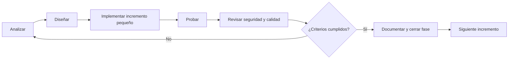

# Proceso de desarrollo

**Estado:** Propuesta  
**Versión:** 0.1  
**Fecha:** 2026-08-12

## 1. Ciclo de vida

El proyecto usará un ciclo iterativo con puertas verificables:

Descubrir un error es información del proceso. Se reproduce, clasifica, explica con evidencia y se corrige con el cambio mínimo suficiente antes de ampliar el alcance.

## 2. Flujo de una característica

1. Vincularla a un requisito o registrar el cambio de alcance.
2. Definir criterios de aceptación y casos de error.
3. Identificar impacto de seguridad, datos, contrato y operación.
4. Escribir o actualizar una ADR si la decisión es significativa y difícil de revertir.
5. Implementar el menor corte vertical demostrable.
6. Añadir pruebas proporcionales al riesgo.
7. Revisar código, contrato, migraciones, logs y documentación.
8. Ejecutar la puerta de calidad y conservar evidencia.

## 3. Definition of Ready

Una tarea está lista para implementación cuando:

- tiene objetivo y valor claros;
- el alcance y los fuera de alcance son visibles;
- posee criterios de aceptación verificables;
- dependencias y decisiones bloqueantes están resueltas;
- se conocen riesgos de seguridad y datos relevantes;
- puede dividirse si es demasiado grande;
- existe una estrategia de prueba.

## 4. Definition of Done

Una tarea está terminada cuando:

- cumple criterios de aceptación y requisitos vinculados;
- el código es legible, tipado y consistente con la arquitectura;
- las pruebas de éxito, límites y error pasan;
- entradas, permisos, secretos y errores fueron revisados;
- logs y métricas permiten diagnosticar el comportamiento relevante;
- contratos, migraciones y documentación están actualizados;
- CI pasa sin ignorar fallos;
- no deja defectos críticos o importantes conocidos sin decisión explícita;
- se puede desplegar y revertir o recuperar de manera documentada.

## 5. Gestión del repositorio

La estrategia exacta se confirmará al inicializar Git. Recomendación inicial:

- rama principal protegida;
- ramas de vida corta;
- commits pequeños y coherentes;
- Conventional Commits (`feat:`, `fix:`, `docs:`, `test:`, `refactor:`, `chore:`);
- Pull Request con requisito, cambio, evidencia de pruebas, riesgos y rollback;
- revisión obligatoria para cambios de autenticación, autorización, migraciones, ejecución de procesos o despliegue.

No se mezclarán refactors grandes con cambios funcionales sin una razón documentada.

## 6. Versionado y contratos

- Versionado semántico cuando existan releases consumibles.
- API bajo `/v1`; una versión nueva solo para cambios incompatibles.
- OpenAPI será contrato ejecutable y se comprobará en CI.
- Migraciones de base de datos serán incrementales y no se editarán después de publicarse.
- Los cambios compatibles se prefieren a despliegues coordinados frágiles.
- El cliente debe manejar que el servidor tenga una versión compatible distinta.

## 7. Configuración y secretos

- Configuración explícita por ambiente.
- `.env.example` documenta nombres y valores no sensibles.
- Validación de configuración al iniciar, con fallo temprano y mensaje seguro.
- Secretos fuera del código, imágenes, logs y documentación.
- Valores por defecto seguros; producción no debe arrancar con credenciales conocidas.
- Rotación documentada para credenciales de DB, OIDC y Cloudflare.

## 8. Manejo de defectos

### Severidad

| Nivel | Definición | Acción |
|---|---|---|
| Crítico | Pérdida de datos, acceso no autorizado, RCE, secreto expuesto o servicio inseguro | Detener avance; contener y corregir. |
| Importante | Función principal incorrecta, trabajo perdido/bloqueado, degradación seria | Corregir antes de cerrar fase. |
| Menor | Impacto limitado con alternativa segura | Priorizar en backlog con evidencia. |
| Mejora | Calidad o experiencia sin defecto funcional | Evaluar por valor y costo. |

### Procedimiento

1. Capturar mensaje exacto, contexto, versión y correlation ID.
2. Reproducir de forma mínima.
3. Formular hipótesis verificables.
4. Añadir una prueba que falle cuando sea práctico.
5. Aplicar el cambio mínimo y revisar efectos secundarios.
6. Confirmar prueba específica y regresión.
7. Documentar causa raíz cuando el impacto lo justifique.

## 9. Decisiones arquitectónicas

Se crea una ADR cuando una decisión:

- afecta varios componentes o la seguridad;
- introduce una dependencia estructural;
- es costosa de revertir;
- tiene alternativas razonables y trade-offs;
- cambia un supuesto previamente aceptado.

Estados: `Proposed`, `Accepted`, `Superseded`, `Deprecated` o `Rejected`. Una ADR aceptada no se reescribe para ocultar el pasado; otra ADR la reemplaza.

## 10. Observabilidad operativa

Desde el esqueleto deben existir:

- logs JSON o estructurados;
- correlation ID de extremo a extremo;
- `jobId` sin URL o datos sensibles;
- health checks de vida/disponibilidad;
- contadores de trabajos y errores por clasificación;
- duración por etapa y uso de almacenamiento;
- runbook para incidentes frecuentes.

Alertas y dashboards se añadirán cuando haya un entorno operado; primero se definirán señales útiles, no paneles decorativos.

## 11. Revisión al final de cada fase

La revisión debe responder:

- ¿Qué requisitos se demostraron y con qué evidencia?
- ¿Qué falló y cuál fue la causa?
- ¿Qué riesgos cambiaron?
- ¿Qué deuda técnica se aceptó y hasta cuándo?
- ¿La arquitectura sigue siendo la solución más simple suficiente?
- ¿Qué debe aprenderse o decidirse antes de la siguiente fase?

El resultado actualiza roadmap, SRS, ADR y backlog antes de continuar.
