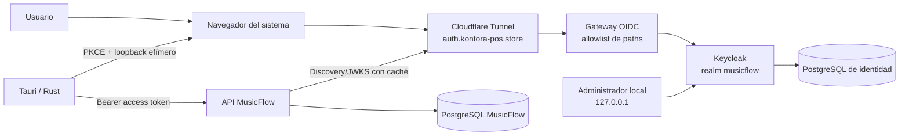

# Fase 2 — fundamento de identidad con Keycloak

**Estado:** Incremento 2.2 aprobado; Fase 2 en curso
**Versión:** 0.2
**Fecha:** 2026-08-13

## 1. Objetivo

Establecer una frontera de identidad OIDC reproducible y segura antes de que la
API acepte trabajos. El proveedor inicial será Keycloak autohospedado, sin
convertir sus roles o su base de datos en el modelo de autorización de
MusicFlow.

Este documento define el camino incremental. La rama documental no levanta el
proveedor ni cambia el contrato HTTP actual.

## 2. Alcance aprobado

Incluido en la Fase 2:

- Keycloak en contenedor y modo de producción;
- PostgreSQL exclusivo de identidad;
- realm `musicflow` y cliente público `musicflow-desktop`;
- Authorization Code mediante navegador externo y PKCE S256;
- callback nativo por `127.0.0.1` y puerto efímero;
- tokens fuera de React y refresh token en Windows Credential Manager;
- validación JWT/JWKS en FastAPI;
- usuario interno por `(issuer, subject)` y autorización por propietario;
- rate limiting inicial, auditoría segura y revocación/deshabilitación;
- publicación OIDC restringida en `auth.kontora-pos.store`.

Fuera de alcance:

- alta disponibilidad, clustering, Kubernetes o una segunda región;
- federación empresarial, LDAP, SAML o proveedores sociales;
- temas visuales personalizados de Keycloak;
- registro público y recuperación de contraseña hasta configurar SMTP;
- usar roles de Keycloak para decidir propiedad de trabajos;
- exponer consola administrativa, health o métricas a Internet;
- implementar trabajos o procesamiento multimedia antes de cerrar la fase.

## 3. Arquitectura recomendada

El gateway OIDC es una defensa local adicional al filtro del túnel. Solo debe
reenviar los paths necesarios para discovery, el realm `musicflow` y recursos
estáticos. El acceso público a `/admin/`, `/realms/master/`, `/health` y
`/metrics` debe devolver 404 o una denegación equivalente sin revelar detalles.

Keycloak y su PostgreSQL compartirán una red interna de identidad. El gateway
será el único componente público que alcance Keycloak; la base no publicará
puertos. La consola se enlazará exclusivamente a `127.0.0.1` durante esta etapa.

## 4. Contrato OIDC inicial

| Elemento | Valor o regla |
|---|---|
| Issuer esperado | `https://auth.kontora-pos.store/realms/musicflow` |
| Realm | `musicflow` |
| Cliente Tauri | `musicflow-desktop` |
| Tipo de cliente | Público, sin secreto |
| Flujo permitido | Standard Flow / Authorization Code |
| PKCE | `S256` obligatorio |
| Callback | `http://127.0.0.1:{puerto-efímero}` |
| Audiencia de API | `musicflow-api` |
| Flujos deshabilitados | Implicit, Direct Access Grants y Service Accounts |
| Identidad interna | UUID asociado de forma única a `(issuer, subject)` |

El listener debe enlazarse antes de abrir el navegador, aceptar una sola
solicitud en una ruta aleatoria o estrictamente definida, validar `state` y
`nonce`, aplicar timeout y cerrarse aunque el flujo falle. No aceptará llamadas
desde interfaces de red distintas de loopback.

El access token permanecerá en memoria de Rust. El refresh token se guardará
mediante una interfaz de almacén seguro con implementación inicial para Windows
Credential Manager. React solo recibirá una vista sanitizada de sesión y
comandos estrechos como `login`, `logout` y `get_current_user`.

## 5. Configuración y secretos

Valores públicos que podrán versionarse o incorporarse al build:

- issuer;
- client ID;
- audiencia;
- redirect base loopback;
- URL de la API.

Secretos que nunca se incluirán en Git, imágenes, argumentos visibles ni el
cliente:

- contraseña bootstrap del administrador;
- contraseña PostgreSQL de Keycloak;
- credenciales SMTP futuras;
- tokens o claves administrativas;
- backups de identidad.

La configuración de realm y cliente se exportará sin usuarios, sesiones,
credenciales ni claves privadas. Se revisará su diff y se probará desde un
volumen vacío para detectar drift.

## 6. Estrategia incremental

### Incremento 2.1 — decisión y frontera

- ADR del proveedor;
- arquitectura, contrato OIDC y modelo de amenazas;
- resolución de PA-002;
- excepción de retención de ramas de la Fase 2.

Puerta: documentación consistente, enlaces válidos, diff limpio y aprobación
del propietario. No requiere construir imágenes porque no cambia runtime.

### Incremento 2.2 — runtime privado reproducible

- imagen Keycloak versionada, optimizada y sin etiqueta flotante;
- PostgreSQL de identidad, volumen, redes y health interno;
- gateway con allowlist local;
- secretos locales ignorados por Git;
- realm/cliente reproducibles y administrador permanente aprovisionado;
- consola accesible solo desde `127.0.0.1`.

La cuenta creada por las opciones bootstrap de Keycloak es temporal. El
aprovisionamiento privado debe crear un administrador permanente, comprobar su
acceso y retirar `temp-admin` antes de publicar OIDC. Su contraseña seguirá en
un archivo ignorado y nunca se mostrará en consola.

Durante este incremento el hostname e issuer son locales para que también el
login del realm administrativo `master` permanezca utilizable sin publicar el
proveedor. `KEYCLOAK_HOSTNAME_URL` usa inicialmente
`http://127.0.0.1:8081`. Keycloak aplica el hostname frontal al endpoint de
autenticación de la consola incluso cuando `hostname-admin` está separado; por
eso no se declarará el issuer público antes de configurar el túnel.

Puerta: inicio desde cero, persistencia tras reinicio, rutas administrativas
rechazadas por el gateway y regresión existente en verde.

El import de realm se usa únicamente para crear una base vacía. Keycloak omite
un realm ya existente durante `--import-realm`; por tanto, todo cambio posterior
de configuración se tratará como una migración explícita, idempotente y
verificable, nunca como una sobreescritura implícita del volumen.

Los usuarios finales de prueba se crearán inmediatamente antes de integrar el
flujo real de login. Añadirlos en este runtime, cuando ningún cliente ni API los
consume todavía, aumentaría datos y credenciales operativas sin aportar una
prueba funcional.

### Incremento 2.3 — publicación OIDC restringida

- hostname `auth.kontora-pos.store` en el túnel existente;
- cambio explícito de `KEYCLOAK_HOSTNAME_URL` a
  `https://auth.kontora-pos.store` y nueva validación de todos los redirects;
- proxy headers habilitados solo después de comprobar que el gateway los
  sobrescribe y que Keycloak solo es alcanzable a través de redes aprobadas;
- issuer estable y proxy headers verificados;
- discovery, login y JWKS públicos;
- master/admin/health/metrics inaccesibles públicamente;
- runbook de inicio, diagnóstico y recuperación.

Puerta: matriz HTTP positiva y negativa ejecutada desde fuera del host, sin
ampliar la ruta pública de la API.

### Incremento 2.4 — sesión segura en Tauri

- PKCE, `state`, `nonce`, listener loopback y navegador externo en Rust;
- almacén seguro y ciclo de refresh/logout;
- interfaz React sin tokens;
- pruebas unitarias, integración e instalador Windows.

Puerta: login, reinicio de aplicación, refresh, logout y callbacks hostiles
probados en el cliente instalado.

### Incremento 2.5 — identidad y autorización de API

- validación JWT/JWKS con fallo cerrado;
- migración de usuario interno;
- endpoint `/v1/me` y frontera reutilizable de propietario;
- usuario deshabilitado, rate limiting y eventos de auditoría;
- pruebas con dos identidades, token inválido/vencido y rotación de claves.

Puerta: los criterios completos de la Fase 2 y la regresión pasan antes de
aceptar cualquier endpoint de trabajos.

## 7. Estrategia de pruebas

- **Configuración:** imagen fijada, cliente público, PKCE S256 y flujos
  inseguros deshabilitados.
- **Infraestructura:** base privada, redes mínimas, health interno, persistencia
  y recreación desde cero.
- **Perímetro:** matriz allow/deny para paths públicos y headers de proxy.
- **Cliente:** estado/nonce incorrectos, timeout, puerto ocupado, callback
  duplicado, código reutilizado, cancelación y limpieza local.
- **JWT:** firma, algoritmo, issuer, audiencia, expiración, `nbf`, `typ`, `kid`
  desconocido y fallo de JWKS.
- **Datos:** unicidad `(issuer, subject)`, concurrencia de alta inicial y usuario
  deshabilitado.
- **Autorización:** dos usuarios y denegación de acceso al propietario distinto.
- **Observabilidad:** correlation ID presente y ausencia de tokens, códigos,
  contraseñas y PII innecesaria en logs.
- **Operación:** backup/restore, actualización controlada y rollback antes de la
  beta pública.

Las pruebas automáticas del backend usarán claves RSA/JWKS locales y no
dependerán de un Keycloak remoto. El recorrido real con Keycloak será una
prueba de integración separada.

## 8. Riesgos aceptados y evolución

- La instancia local es un punto único de fallo. Es aceptable para desarrollo y
  uso personal; antes de usuarios externos se evaluará migrarla a VPS y
  ejecutar restauración real.
- El consumo de recursos aumenta. Se medirá antes de fijar memoria y CPU, sin
  optimizar por intuición.
- Operar identidad exige actualizaciones frecuentes. Cada cambio de versión
  tendrá rama, notas de migración, backup y prueba de rollback.
- El gateway agrega un componente, pero proporciona una frontera verificable
  que evita depender exclusivamente de una configuración remota de Cloudflare.
- Si Keycloak no supera las puertas, otra implementación OIDC podrá explorarse
  en una rama nueva. Las ramas integradas de la Fase 2 permanecerán congeladas
  para comparar evidencia, mientras `main` representará la decisión vigente.

## 9. Conceptos de aprendizaje

Este incremento permite comprender y justificar:

- diferencia entre autenticación, autorización y proveedor de identidad;
- cliente público frente a cliente confidencial;
- PKCE, `state`, `nonce`, issuer, audience, JWKS y rotación de claves;
- por qué el correo no debe ser una clave de propiedad;
- separación entre plano público OIDC y plano administrativo;
- costo real del self-hosting: parches, backups, disponibilidad y respuesta a
  incidentes.

## 10. Referencias

- [Keycloak: Getting started with Docker](https://www.keycloak.org/getting-started/getting-started-docker)
- [Keycloak: Running in a container](https://www.keycloak.org/server/containers)
- [Keycloak: Production configuration](https://www.keycloak.org/server/configuration-production)
- [Keycloak: Reverse proxy](https://www.keycloak.org/server/reverseproxy)
- [Keycloak: Hostname v2](https://www.keycloak.org/server/hostname)
- [RFC 8252: OAuth 2.0 for Native Apps](https://datatracker.ietf.org/doc/html/rfc8252)
- [RFC 9700: OAuth 2.0 Security Best Current Practice](https://www.rfc-editor.org/rfc/rfc9700.html)
