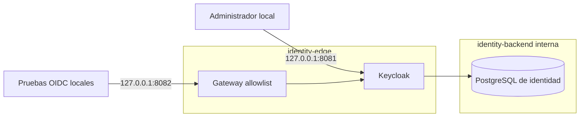

# Fase 2 — incremento 2: runtime privado de Keycloak

**Estado:** Aprobado

**Versión:** 0.1

**Fecha:** 2026-08-13

## 1. Objetivo

Demostrar una frontera de identidad OIDC privada, persistente y reproducible
antes de publicar el proveedor, integrar login en Tauri o validar tokens en la
API. Toda la operación usa Docker; no instala Java, Keycloak, PostgreSQL ni
dependencias del proyecto en Windows.

## 2. Alcance implementado

- Keycloak `26.7.0` en una imagen optimizada y fijada también por digest;
- PostgreSQL exclusivo de identidad, sin puerto publicado;
- realm `musicflow` importable desde una base vacía;
- cliente nativo público `musicflow-desktop` con Authorization Code y PKCE
  `S256`;
- recurso `musicflow-api` y mapper de audiencia;
- gateway Nginx local que permite solo `/realms/musicflow/` y `/resources/`;
- consola administrativa y gateway enlazados únicamente a `127.0.0.1`;
- secretos aleatorios en archivos de `.secrets/`, ignorados por Git;
- administrador permanente y retiro de la cuenta temporal `temp-admin`;
- cliente de servicio local con permisos de solo lectura para verificaciones;
- verificación automatizada sobre persistencia real y sobre un volumen vacío.

Fuera de alcance:

- hostname público, TLS y proxy headers de Cloudflare;
- usuarios finales de prueba y MFA del administrador;
- login Tauri, almacenamiento de tokens y validación JWT en la API;
- SMTP, recuperación de contraseña y registro público;
- backup/restore operativo y actualización de versión.

## 3. Topología privada



`identity-edge` no es una red Docker `internal`, porque una red interna impide
materializar los bindings del host incluso cuando Compose declara `ports`. La
frontera se conserva con bindings explícitos a loopback. `identity-backend` sí
permanece interna y PostgreSQL no declara `ports`.

## 4. Configuración de seguridad

El realm aplica:

- registro y recuperación pública deshabilitados;
- protección contra fuerza bruta;
- contraseña mínima de 12 caracteres con mayúscula, minúscula, número,
  carácter especial, prohibición del username e historial de cinco;
- access tokens de 10 minutos;
- rotación de refresh tokens sin reutilización;
- eventos de usuario y de administración habilitados.

El cliente desktop es público porque una aplicación instalada no puede guardar
un client secret. Solo permite Standard Flow, exige PKCE `S256` y usa el
callback loopback especial `http://127.0.0.1`, para el cual Keycloak admite un
puerto efímero. Implicit, Direct Access Grants y Service Accounts están
deshabilitados.

Keycloak y el gateway ejecutan usuarios no root (`1000` y `101`), descartan
capabilities, usan filesystem de solo lectura y escriben temporales únicamente
en `tmpfs`. Los secretos no aparecen en el entorno declarado por Compose:
PostgreSQL usa `POSTGRES_PASSWORD_FILE` y el entrypoint de Keycloak lee los
archivos montados sin imprimirlos.

## 5. Preparación e inicio

Con Docker Desktop activo y desde el repositorio:

```powershell
Set-Location C:\Users\Genoma\Documents\MusicFlow
powershell.exe -NoProfile -ExecutionPolicy Bypass -File .\scripts\initialize-identity-secrets.ps1
powershell.exe -NoProfile -ExecutionPolicy Bypass -File .\scripts\verify-identity.ps1 -Fresh
docker compose --profile identity up --detach --build --wait keycloak-gateway
```

La prueba `-Fresh` usa el proyecto temporal
`musicflow-identity-verify`, los puertos `18081` y `18082`, y elimina solo su
volumen temporal. El script rechaza nombres fuera del prefijo protegido para no
borrar por accidente la identidad operativa.

Después del primer arranque operativo se prepara el administrador permanente:

```powershell
powershell.exe -NoProfile -ExecutionPolicy Bypass -File .\scripts\configure-identity-admin.ps1
powershell.exe -NoProfile -ExecutionPolicy Bypass -File .\scripts\verify-identity.ps1 -KeepRunning
```

La consola local queda en
`http://127.0.0.1:8081/admin/master/console/`. El usuario es
`musicflow-admin`; la contraseña se obtiene localmente del archivo ignorado
`.secrets/keycloak-admin-password`. No debe copiarse a documentación, commits o
mensajes.

La automatización no usa las credenciales humanas. El aprovisionamiento crea
`musicflow-identity-verifier`, un cliente confidencial con Service Accounts,
scope explícito y únicamente `query-clients`, `view-clients` y `view-realm`
sobre `musicflow-realm`. Así el administrador puede habilitar MFA sin romper la
puerta automática y el verificador no puede escribir configuración.

## 6. Operación segura

Estado:

```powershell
docker compose --profile identity ps keycloak-postgres keycloak keycloak-gateway
```

Detención conservando datos:

```powershell
docker compose --profile identity stop keycloak-gateway keycloak keycloak-postgres
```

Reinicio:

```powershell
docker compose --profile identity up --detach --wait keycloak-gateway
```

No ejecutar `docker compose down --volumes` sobre el proyecto operativo: esa
orden elimina la base de identidad. La eliminación de volúmenes se reserva al
proyecto temporal controlado por `verify-identity.ps1 -Fresh`.

## 7. Administración y migraciones

Keycloak crea una cuenta bootstrap temporal solo cuando inicializa el realm
`master`. El script de aprovisionamiento crea `musicflow-admin`, comprueba que
puede administrar el realm `musicflow` y elimina `temp-admin`. Es idempotente:
una segunda ejecución verifica el cliente de servicio de solo lectura y termina
sin usar las credenciales humanas; por ello continúa funcionando después de
habilitar MFA.

La importación `--import-realm` tampoco es un mecanismo de actualización:
Keycloak omite realms que ya existen para preservar datos. Por ello, cualquier
cambio futuro del JSON requiere un script de migración administrativa explícito
y verificable. El JSON sigue siendo la fuente para instalaciones nuevas, pero
no reemplaza silenciosamente la configuración persistida.

Antes de publicar OIDC se exigirá MFA al administrador permanente y se
documentará un procedimiento de recuperación que cree una cuenta temporal con
todos los nodos Keycloak detenidos y la elimine al terminar.

## 8. Evidencia de aceptación automatizada

El 2026-08-13 se verificó:

- build reproducible de la imagen optimizada;
- tres servicios healthy;
- PostgreSQL sin publicación de puertos;
- consola y gateway ligados únicamente a loopback;
- usuarios no root y red de datos interna;
- discovery con issuer local y PKCE `S256`;
- JWKS con claves de firma consultado por el gateway;
- rutas `/`, `/admin/`, `/realms/master/`, `/health` y `/metrics` rechazadas
  con HTTP 404 en el gateway;
- realm, cliente, redirect loopback, flujos deshabilitados y audiencia;
- ausencia de la cuenta `temp-admin` en el estado operativo;
- verificación automática mediante un cliente de servicio de solo lectura;
- lectura administrativa HTTP 200 y escritura administrativa rechazada con
  HTTP 403 para ese verificador;
- persistencia después de reiniciar Keycloak;
- creación completa desde volumen vacío y limpieza del proyecto temporal.
- una credencial OTP registrada para `musicflow-admin`, sin consultar su
  semilla ni códigos;
- cierre de sesión y nuevo acceso manual mediante contraseña y código OTP;
- puerta automatizada aprobada después de habilitar MFA y reiniciar Keycloak.

La consola también se abrió mediante una prueba visual de solo lectura y llegó
a la pantalla de acceso local. No se introdujeron credenciales en el navegador
automatizado.

## 9. Incidencias y decisiones derivadas

1. El gateway no podía iniciar con filesystem de solo lectura porque Nginx
   intentaba escribir en `/var/cache`; sus rutas temporales se movieron a
   `/tmp` montado como `tmpfs`.
2. Una red Docker marcada `internal` no materializaba los bindings locales. Se
   separó la red de entrada de la red interna de datos.
3. Un issuer público prematuro redirigía la consola administrativa al hostname
   todavía inexistente. El incremento usa temporalmente
   `http://127.0.0.1:8081` y cambiará el issuer de forma explícita en 2.3.
4. El puerto 8000 ya pertenecía a la API operativa. La regresión del backend
   ahora acepta un puerto temporal configurable sin detener ese servicio.
5. El import no actualizó una política añadida al realm existente. Esto confirmó
   que las actualizaciones requieren migraciones explícitas.
6. La primera asignación del administrador confundió los roles del cliente
   `master-realm` con el rol global compuesto `admin`. Se recuperó localmente la
   cuenta temporal, se asignó el rol correcto, se comprobó el acceso global y
   se retiró de nuevo `temp-admin`.
7. Usar las credenciales humanas en la prueba habría impedido exigir MFA. Se
   sustituyeron por un cliente de servicio de solo lectura; sus roles y sus role
   scope mappings se declaran por separado porque el token contiene la
   intersección de ambos.

## 10. Criterios del incremento

- [x] imagen fijada y optimizada;
- [x] base de identidad privada y persistente;
- [x] secretos fuera del repositorio;
- [x] realm y clientes reproducibles desde cero;
- [x] gateway con allowlist positiva y pruebas negativas;
- [x] consola solo local;
- [x] administrador permanente y bootstrap retirado;
- [x] verificador automatizado separado de la cuenta humana y sin permisos de escritura;
- [x] reinicio y persistencia comprobados;
- [x] prueba limpia aislada comprobada;
- [x] MFA del administrador comprobado manualmente;
- [x] regresión completa del backend ejecutada después de los cambios finales;
- [x] aceptación manual y aprobación del propietario.

## 11. Decisión de cierre

El propietario aprobó el incremento el 2026-08-13 después de configurar OTP,
cerrar la sesión administrativa y comprobar un nuevo acceso que exigió
contraseña y código de seguridad. La base confirmó exactamente una credencial
de tipo `otp` para `musicflow-admin` sin leer datos sensibles. Después de esa
configuración, la puerta automatizada volvió a aprobar build, contrato OIDC,
permisos del verificador, reinicio y persistencia.

El incremento 2.2 queda listo para integrarse en `main`. La rama
`feat/phase-2-keycloak-runtime` se conservará congelada localmente y en `origin`
después del merge, conforme a la excepción aprobada para la Fase 2.

## 12. Siguiente incremento

El incremento 2.3 cambiará el issuer a
`https://auth.kontora-pos.store`, habilitará y validará proxy headers, conectará
un hostname específico del Cloudflare Tunnel al gateway y ejecutará una matriz
pública positiva/negativa. No ampliará el túnel de la API ni expondrá consola,
realm `master`, health o métricas.

## 13. Referencias

- [Keycloak: contenedores](https://www.keycloak.org/server/containers)
- [Keycloak: bootstrap y recuperación de administrador](https://www.keycloak.org/server/bootstrap-admin-recovery)
- [Keycloak: importación y exportación](https://www.keycloak.org/server/importExport)
- [Keycloak: proxy inverso](https://www.keycloak.org/server/reverseproxy)
- [Keycloak: administración](https://www.keycloak.org/docs/latest/server_admin/)
- [Docker: publicación de puertos](https://docs.docker.com/engine/network/port-publishing/)
