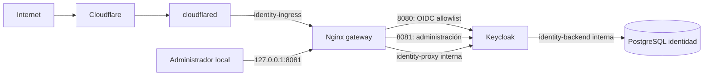

# Fase 2 — incremento 3: publicación OIDC restringida

**Estado:** Aprobado

**Versión:** 0.9.0

**Fecha:** 2026-08-13

## 1. Objetivo

Publicar exclusivamente el contrato OIDC del realm `musicflow` en
`https://auth.kontora-pos.store`, conservar la administración de Keycloak en
`127.0.0.1` y mantener sin cambios la ruta pública mínima de la API.

Este incremento no integra todavía login en Tauri ni validación JWT en
FastAPI. Su puerta demuestra primero que el emisor estable existe y que la
frontera pública no expone superficies administrativas u operativas.

## 2. Arquitectura implementada



El gateway ofrece dos puertas dentro del mismo contenedor:

- puerto interno `8080`: permite únicamente `/realms/musicflow/` y
  `/resources/`; Cloudflare lo alcanza como `http://keycloak-gateway:8080`;
- puerto interno `8081`: reenvía la administración, pero Docker lo publica
  solamente como `127.0.0.1:8081`.

Keycloak ya no publica puertos directamente. `cloudflared` comparte
`identity-ingress` con Nginx, pero no pertenece a `identity-proxy`; por ello no
puede saltarse el filtro y llegar a Keycloak. PostgreSQL continúa sin puertos y
en una red interna separada.

## 3. Hostnames y proxy confiable

El realm de aplicación usa el emisor estable:

```text
https://auth.kontora-pos.store/realms/musicflow
```

Keycloak interpreta cabeceras `X-Forwarded-*` solo desde la subred interna
`identity-proxy`. Nginx no conserva valores recibidos desde Internet: los
sobrescribe con host `auth.kontora-pos.store`, esquema `https` y puerto `443`.
Esto evita que un cliente elija el issuer o el origen mediante cabeceras
forjadas.

La consola administrativa utiliza:

```text
http://127.0.0.1:8081/admin/master/console/
```

`KC_HOSTNAME_ADMIN` separa las URLs administrativas, pero no bloquea por sí
solo la API de administración. El rechazo público se implementa en Nginx. Una
prueba aislada confirmó además que el realm `master` intenta usar el hostname
frontal general para autenticarse si no tiene una URL propia. Por ello se migró
su atributo `frontendUrl` a `http://127.0.0.1:8081`: contraseña y OTP del
administrador permanecen locales, mientras `musicflow` conserva el issuer
público.

## 4. Migración administrativa reproducible

`configure-identity-publication.ps1` aplica ese cambio sin deshabilitar MFA ni
usar la credencial humana:

1. detiene los nodos Keycloak;
2. crea mediante `bootstrap-admin service` un cliente administrativo temporal;
3. inicia el runtime y actualiza únicamente `master.attributes.frontendUrl`;
4. valida que `authServerUrl` y `adminBaseUrl` sean locales;
5. elimina el cliente temporal y confirma que ya no puede autenticarse;
6. recupera automáticamente el runtime ante un fallo.

El secreto aleatorio temporal existe en
`.secrets/keycloak-publication-admin-client-secret`, está ignorado por Git y se
monta solo en el contenedor transitorio del comando de migración. No se agrega
al entorno permanente de Keycloak.

La migración fue probada primero sobre un volumen desechable y posteriormente
aplicada al volumen operativo. La verificación posterior al reinicio confirmó
que el usuario `musicflow-admin`, su OTP y el cliente verificador de solo
lectura se conservaron.

## 5. Ruta en Cloudflare Tunnel

El túnel existente `musicflow-local-api` contiene ahora dos aplicaciones
independientes:

| Hostname | Path remoto | Origen Docker |
|---|---|---|
| `api.kontora-pos.store` | solo `^/health/live$` | `http://api:8000` |
| `auth.kontora-pos.store` | vacío, todos los paths | `http://keycloak-gateway:8080` |

El hostname OIDC no usa un filtro de path remoto porque Keycloak necesita
varios endpoints y recursos estáticos. La allowlist verificable permanece en
Nginx; cualquier otro path recibe 404. El conector sigue sin puertos publicados
y el token continúa montado como secreto.

Cloudflare Access no debe colocarse delante del hostname OIDC: cambiaría el
contrato estándar y bloquearía discovery, callbacks y clientes nativos. Los
controles adecuados en esta frontera son TLS, gateway mínimo, protección de
fuerza bruta de Keycloak, WAF/rate limiting proporcional y actualización del
proveedor.

## 6. Operación

Preparar secretos y migrar una instalación existente, una sola vez:

```powershell
Set-Location C:\Users\Genoma\Documents\MusicFlow
powershell.exe -NoProfile -ExecutionPolicy Bypass -File .\scripts\initialize-identity-secrets.ps1
powershell.exe -NoProfile -ExecutionPolicy Bypass -File .\scripts\configure-identity-publication.ps1
```

Iniciar plataforma, identidad y túnel:

```powershell
docker compose --profile identity --profile tunnel up --detach --build --wait api keycloak-gateway cloudflared
```

Verificar el contrato privado/reproducible y la publicación:

```powershell
powershell.exe -NoProfile -ExecutionPolicy Bypass -File .\scripts\verify-identity.ps1 -Fresh
powershell.exe -NoProfile -ExecutionPolicy Bypass -File .\scripts\verify-identity-publication.ps1
```

La primera prueba crea y elimina un volumen temporal. La segunda consulta el
hostname desde fuera de Docker y no modifica estado.

## 7. Matriz de aceptación

El 2026-08-13 se comprobó:

| Prueba | Resultado |
|---|---|
| DNS A/AAAA para `auth.kontora-pos.store` | Presente |
| OIDC discovery público | HTTP 200, issuer exacto |
| JWKS público | HTTP 200, al menos una clave |
| PKCE anunciado | `S256` |
| Inicio de Authorization Code | HTTP 200/302 |
| `/`, `/admin/`, consola admin pública | HTTP 404 |
| `/realms/master/` y discovery de `master` | HTTP 404 |
| `/health`, `/health/ready`, `/metrics` | HTTP 404 |
| `/gateway-health` público | HTTP 404 |
| consola y autenticación de `master` local | HTTP 200, URL loopback |
| Keycloak directo desde host | sin puerto publicado |
| API `/health/live` | HTTP 200 sin cambios |
| API `/` y `/health/ready` | HTTP 404 sin cambios |
| reinicio del volumen operativo | aprobado |
| credencial OTP de `musicflow-admin` | exactamente 1 |
| cliente temporal de publicación | exactamente 0 |
| `master.frontendUrl` local | exactamente 1 |
| regresión backend en puerto temporal `18000` | 10 pruebas aprobadas |

La matriz pública se automatiza en `verify-identity-publication.ps1`. No
registra tokens, contraseñas, cookies ni cuerpos de páginas de login.

## 8. Incidencias y razonamiento deductivo

1. **La consola local elegía el issuer público para `master`.** `hostname-admin`
   cambiaba los recursos y API administrativos, pero no el endpoint de login.
   La evidencia del JSON embebido en la consola mostró
   `authServerUrl=https://auth.kontora-pos.store`. Configurar el `frontendUrl`
   del realm `master` lo cambió a loopback sin afectar `musicflow`.
2. **Una IP fija de Keycloak impedía `docker compose run`.** El contenedor
   transitorio competía por la misma dirección. Confiar en toda la subred
   `identity-proxy`, interna y limitada a gateway/Keycloak, conserva la frontera
   y permite el procedimiento oficial de recuperación.
3. **El comando de cuenta de servicio heredaba el bootstrap de usuario.** La
   presencia simultánea de usuario y cliente bootstrap produjo una validación
   incompatible. El script elimina esas variables solo dentro del contenedor
   temporal.
4. **La primera consulta pública falló dentro del sandbox.** DNS ya resolvía,
   pero la red saliente estaba bloqueada. La misma matriz con permiso de red
   terminó correctamente; no se modificó el túnel para resolver un límite del
   entorno de pruebas.
5. **Cloudflare rechazó el origen inicialmente.** Faltaba el esquema. El valor
   correcto es `http://keycloak-gateway:8080`: HTTPS termina en Cloudflare y el
   tramo interno viaja por la red Docker.
6. **La primera regresión del backend colisionó con el puerto operativo.** El
   stack público ya usaba `127.0.0.1:8000`; el verificador temporal no alcanzó
   los tests de runtime. Se repitió con su parámetro soportado `-ApiPort 18000`,
   sin detener la API, y aprobó las 10 pruebas. Persiste una advertencia de
   deprecación conocida entre Starlette TestClient y `httpx`.

## 9. Riesgos y límites restantes

- La disponibilidad depende todavía de un solo equipo, un conector y una base;
  es aceptado para desarrollo local, no para un despliegue masivo.
- El dominio público permite iniciar login, pero todavía no existen usuario
  final de prueba ni integración Tauri.
- No se implementaron SMTP, recuperación de cuenta, backup/restore probado ni
  política de actualización de Keycloak; deberán cerrarse antes de producción.
- La API aún no valida JWT, por lo que esta publicación no autoriza endpoints
  de negocio.
- WAF y rate limiting se añadirán con métricas y casos concretos, sin reglas que
  rompan OAuth/OIDC.

## 10. Conceptos aprendidos

- Terminación TLS en el edge frente a HTTP en una red privada.
- Separación entre hostname frontend, administrativo y realm frontend URL.
- Proxy confiable: sobrescribir cabeceras y restringir quién puede enviarlas.
- Defensa en profundidad: ruta de túnel, gateway de allowlist y redes Docker.
- Migraciones explícitas e idempotentes para estado persistido de identidad.
- Pruebas positivas y negativas de una superficie pública.

En entrevistas y sistemas reales se debe poder justificar por qué
`hostname-admin` no es un control de acceso, por qué un cliente nativo usa
Authorization Code + PKCE sin secreto y por qué el `iss` de un JWT es parte de
su contrato de seguridad.

## 11. Control de versiones

El incremento se desarrolla en `feat/phase-2-keycloak-publication`. Tras su
aprobación se integrará mediante merge no fast-forward y se etiquetará como
`phase-2-increment-3`. La rama permanecerá congelada localmente y en `origin`
conforme a la excepción de retención de la Fase 2.

## 12. Criterios del incremento

- [x] DNS y ruta del túnel para `auth.kontora-pos.store`;
- [x] issuer público exacto y estable;
- [x] proxy headers sobrescritos y proxy confiable restringido;
- [x] Keycloak sin puertos directos y redes de ingreso/datos separadas;
- [x] discovery, JWKS, PKCE e inicio de login públicos;
- [x] administración, `master`, health y métricas rechazados públicamente;
- [x] consola y autenticación del realm `master` ligadas a loopback;
- [x] migración explícita, idempotente y sin credencial humana;
- [x] cliente administrativo temporal retirado;
- [x] MFA del administrador preservado;
- [x] API pública sin ampliar su contrato;
- [x] identidad desde cero y regresión backend aprobadas;
- [x] aceptación manual y aprobación del propietario.

## 13. Decisión de cierre

El propietario aprobó el incremento el 2026-08-13 después de comprobar
manualmente el discovery público y un nuevo inicio de sesión en la consola
local con contraseña y OTP. La puerta automatizada ya había confirmado el
issuer público, JWKS, PKCE, el inicio del flujo de autorización y el rechazo de
las rutas sensibles.

La base confirmó, sin leer secretos, exactamente una credencial `otp` para
`musicflow-admin`, ningún cliente administrativo temporal y una única URL
frontal local para el realm `master`. La regresión del backend aprobó sus 10
pruebas en el puerto temporal `18000` sin interrumpir la API pública.

El incremento 2.3 queda listo para integrarse en `main`. La rama
`feat/phase-2-keycloak-publication` se conservará congelada localmente y en
`origin` después del merge, conforme a la excepción aprobada para la Fase 2.

## 14. Siguiente incremento

El incremento 2.4 creará un usuario final controlado e integrará en Tauri el
Authorization Code Flow con PKCE, navegador del sistema y callback loopback de
puerto efímero. Los tokens permanecerán fuera de React y el refresh token se
protegerá mediante el almacén de credenciales del sistema operativo.

## 15. Referencias

- [Keycloak: configuración de hostname](https://www.keycloak.org/server/hostname)
- [Keycloak: proxy inverso](https://www.keycloak.org/server/reverseproxy)
- [Keycloak: configuración para producción](https://www.keycloak.org/server/configuration-production)
- [Keycloak: recuperación administrativa](https://www.keycloak.org/server/bootstrap-admin-recovery)
- [Cloudflare Tunnel: routing](https://developers.cloudflare.com/tunnel/routing/)
- [RFC 8252: OAuth 2.0 for Native Apps](https://datatracker.ietf.org/doc/html/rfc8252)
- [RFC 7636: Proof Key for Code Exchange](https://datatracker.ietf.org/doc/html/rfc7636)
