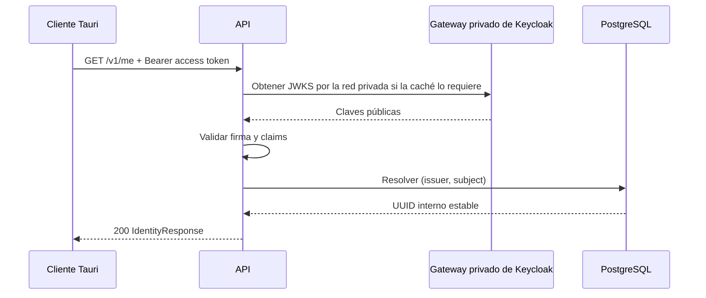

# Fase 2 — incremento 5: validación JWT y autorización de la API

## 1. Objetivo

Establecer la frontera de confianza de la API antes de aceptar trabajos. El
incremento validará access tokens emitidos para `musicflow-api`, resolverá una
identidad interna estable y comprobará una política de propiedad entre dos
usuarios distintos.

No se implementarán todavía trabajos, descargas, `yt-dlp`, FFmpeg, roles
administrativos ni registro público.

## 2. Estado de entrada

- Keycloak publica discovery y JWKS mediante
  `https://auth.kontora-pos.store/realms/musicflow`.
- `musicflow-desktop` usa Authorization Code con PKCE S256.
- El mapper `musicflow-api-audience` incluye `musicflow-api` solamente en el
  access token; el ID token no recibe esa audiencia.
- La API expone únicamente `/health/live` y `/health/ready`.
- PostgreSQL tiene una migración base vacía y aún no contiene identidades ni
  recursos de usuario.

## 3. Decisión técnica

La API validará JWT localmente con las claves públicas del JWKS de Keycloak:

1. extraerá el bearer token sin registrarlo;
2. resolverá la clave por `kid` desde un JWKS cacheado;
3. permitirá únicamente `RS256`;
4. validará firma, `exp`, `iat`, `iss`, `aud` y `sub`;
5. aceptará una desviación de reloj pequeña y configurada;
6. mapeará `(issuer, subject)` a un UUID interno;
7. aplicará autorización usando el UUID interno, nunca correo o nombre.

`PyJWT[crypto]` es la opción recomendada porque ofrece validación explícita,
resolución JWKS, caché y actualización ante un `kid` nuevo con una superficie
menor que un cliente OAuth completo. La obtención síncrona de JWKS se ejecutará
fuera del event loop de FastAPI.

### Alternativas descartadas por ahora

- **Introspección por petición:** permite conocer revocación con mayor rapidez,
  pero exige un cliente confidencial, distribuye un secreto a la API y convierte
  Keycloak en dependencia de red de cada llamada.
- **Authlib:** es válida para escenarios OAuth/OIDC más amplios, pero añade más
  funcionalidad de la necesaria para un resource server pequeño.
- **Autorización en Cloudflare o el gateway:** puede complementar el perímetro,
  pero no conoce la propiedad de recursos ni sustituye la autorización de la
  aplicación.

## 4. Arquitectura mínima



La implementación se dividirá en:

- `musicflow.security`: verificación criptográfica y principal externo;
- `musicflow.db`: tabla y repositorio de identidades internas;
- `musicflow.api.dependencies`: adaptación HTTP Bearer;
- `musicflow.authorization`: política pura de propiedad;
- `musicflow.api.routes.identity`: contrato protegido `/v1/me`.

## 5. Configuración

Variables públicas, sin secretos:

| Variable                            | Valor inicial                                     | Restricción                                        |
| ----------------------------------- | ------------------------------------------------- | -------------------------------------------------- |
| `MUSICFLOW_OIDC_ISSUER`             | `https://auth.kontora-pos.store/realms/musicflow` | HTTPS exacto en producción, sin query ni fragmento |
| `MUSICFLOW_OIDC_AUDIENCE`           | `musicflow-api`                                   | cadena no vacía                                    |
| `MUSICFLOW_OIDC_JWKS_URL`            | `http://keycloak-gateway:8080/.../certs`          | endpoint fijo en la red privada                     |
| `MUSICFLOW_OIDC_JWKS_CACHE_SECONDS` | `300`                                             | límite positivo y acotado                          |
| `MUSICFLOW_OIDC_CLOCK_SKEW_SECONDS` | `30`                                              | máximo pequeño y explícito                         |

El `issuer` público se valida exactamente contra el claim `iss`, mientras que
la URL JWKS se configura por el operador para usar el gateway privado. Nunca se
acepta una URL suministrada por el token, evitando convertir la validación en un
vector SSRF. Esta separación mantiene la identidad pública del emisor sin
obligar a la API a salir por Cloudflare para obtener una clave pública local.

## 6. Persistencia de identidad

La migración creará `user_identities`:

| Columna      | Tipo        | Regla                         |
| ------------ | ----------- | ----------------------------- |
| `id`         | UUID        | clave primaria interna        |
| `issuer`     | varchar     | parte de la identidad externa |
| `subject`    | varchar     | `sub` opaco del proveedor     |
| `created_at` | timestamptz | creación auditable            |

La pareja `(issuer, subject)` será única. La resolución utilizará una inserción
idempotente con conflicto controlado para soportar dos primeras peticiones
concurrentes sin crear duplicados.

No se persistirán access tokens, refresh tokens, correos, nombres ni códigos MFA.

## 7. Contrato HTTP

### Público

- `GET /health/live`
- `GET /health/ready`

### Protegido

- `GET /v1/me`

Respuesta inicial:

```json
{
  "id": "00000000-0000-0000-0000-000000000000"
}
```

La API no expondrá `issuer` ni `subject` salvo que aparezca una necesidad real.

Semántica de errores:

- `401` y `WWW-Authenticate: Bearer`: credencial ausente, malformada, vencida o
  con firma, issuer o audiencia incorrectos;
- `403`: identidad válida que no es propietaria del recurso;
- `503`: JWKS no disponible cuando no existe una clave utilizable en caché.

Las respuestas serán genéricas y no revelarán cuál claim falló.

## 8. Autorización por propietario

Se implementará una función independiente de FastAPI que reciba
`requester_user_id` y `resource_owner_id`:

- coincidencia: permite continuar;
- diferencia: produce una denegación tipada que la API traduce a `403`.

Todavía no se creará un recurso de producción artificial. La política se
comprobará con dos identidades y un recurso de prueba; el primer endpoint de
trabajos de la Fase 3 deberá usarla y repetir la prueba IDOR a nivel HTTP.

## 9. Estrategia de pruebas

### Unitarias

- token válido con issuer, audiencia, firma y tiempos correctos;
- token vencido, prematuro, sin claims obligatorios o con algoritmo no permitido;
- issuer, audiencia, firma y `kid` incorrectos;
- bearer ausente, esquema incorrecto y token excesivamente largo;
- usuario A autorizado y usuario B rechazado sobre el mismo propietario;
- configuración de producción rechaza issuer no HTTPS.

### Integración

- migración upgrade y downgrade;
- resolución repetida devuelve el mismo UUID;
- dos subjects distintos producen UUID distintos;
- concurrencia inicial no genera identidades duplicadas;
- `/v1/me` exige autenticación y no altera los health checks.

### Contrato y seguridad

- OpenAPI marca `/v1/me` con Bearer auth;
- `401`, `403` y `503` usan códigos estables y no filtran tokens ni claims;
- logs contienen correlation ID y resultado general, nunca credenciales;
- rotación de `kid` refresca JWKS de forma acotada.

## 10. Observabilidad y operación

Se emitirán eventos estructurados para validación aceptada, credencial rechazada,
denegación por propiedad y fallo de JWKS. Solo incluirán correlation ID, código de
resultado y, después de resolverla, la identidad interna cuando sea necesario.

La caché permite continuar validando firmas conocidas durante una interrupción
temporal. En un arranque frío sin JWKS, los endpoints protegidos fallarán cerrados
con `503`; los health checks conservarán su semántica actual.

## 11. Riesgos y trade-offs

- Deshabilitar una cuenta no invalida instantáneamente un access token ya
  emitido; el riesgo queda acotado por su vida actual de diez minutos.
- Una caché demasiado larga retrasa la adopción de claves nuevas; una demasiado
  corta aumenta dependencia y tráfico hacia Keycloak.
- Crear la identidad en la primera llamada válida simplifica la beta, pero exige
  una restricción única y manejo correcto de concurrencia.
- La política de propiedad queda preparada en esta fase, pero su primera
  aplicación sobre trabajos reales pertenece a la Fase 3.

### Incidente de validación real: 403 al obtener JWKS

En la primera prueba del instalador, Keycloak completó correctamente el login y
el callback local, pero `/v1/me` respondió `503`. Los logs estructurados
identificaron `identity_provider_unavailable`. La misma URL JWKS respondía `200`
desde Windows y `403` desde el contenedor cuando `PyJWKClient` usaba el
User-Agent predeterminado de Python.

Aunque un User-Agent personalizado evitaba el bloqueo, se descartó como
solución permanente por depender de las reglas de Cloudflare. La corrección es
usar `keycloak-gateway:8080` sobre `identity-ingress` para JWKS y conservar el
issuer HTTPS público para la validación del token.

## 12. Cierre de la pestaña de retorno

La validación con Chrome confirmó que una pestaña iniciada por el sistema no es
cerrable mediante `window.close()`. Se evaluó un retorno mediante el esquema
`musicflow://`, pero no resolvía el cierre y añadía registro de protocolo, dos
plugins nativos y manejo de instancia única sin aportar una capacidad necesaria.

Por simplicidad y menor superficie de ataque, se retiraron el botón, el esquema
personalizado y sus dependencias. Después de recibir el callback, la página solo
informa que MusicFlow recibió el retorno y que el usuario puede cerrar la pestaña
manualmente. No ejecuta JavaScript ni realiza solicitudes adicionales.

## 13. Puerta de salida

Estado: **aprobada el 14 de agosto de 2026**.

El incremento exigía:

1. las pruebas de token válido e inválido estén en verde;
2. `/v1/me` funcione con el access token real del cliente;
3. health siga disponible sin token;
4. dos identidades internas no puedan confundirse;
5. la política de propiedad rechace al segundo usuario;
6. migraciones, reinicio y regresión general pasen;
7. no exista ningún token o secreto en archivos, logs o fixtures;
8. documentación y procedimiento de rollback estén actualizados.

Evidencia final:

- backend reproducible en Docker: `pip check`, Ruff y formato correctos;
- 27 pruebas backend superadas, incluidas migraciones, JWT, identidad y
  propiedad;
- API, worker y PostgreSQL saludables; solo la API publicó el puerto de prueba;
- 22 pruebas web y build de producción superados;
- 8 pruebas Rust superadas y un único instalador NSIS generado;
- login real Keycloak → cliente → `/v1/me` → PostgreSQL validado;
- al detener la API, el cliente informó indisponibilidad y se recuperó al
  levantarla nuevamente;
- el callback final no contiene scripts, tokens, protocolo personalizado ni
  solicitudes propias adicionales;
- la validación visual y funcional fue aprobada manualmente.

## 14. Control de versiones

El trabajo vive en `feat/phase-2-api-jwt-authorization`. Con la puerta técnica y
la validación manual completas, se integrará en `main`. La rama se conservará
localmente y en `origin` después del merge, conforme a la decisión de la Fase 2.
